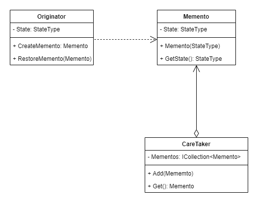

## MEMENTO PATTERN
##### use when an object have different state,and in each state it behaves differently

IDEA: encapsulate the changing into separate class & create class responsible to track the history

